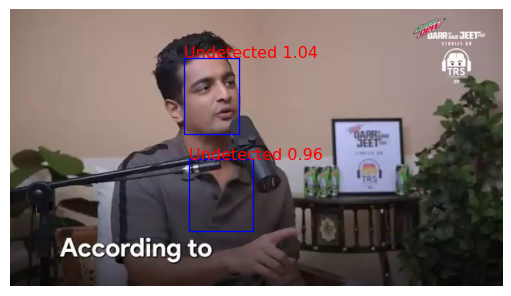
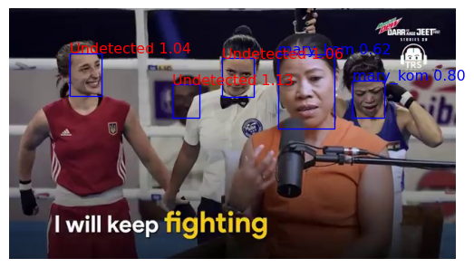
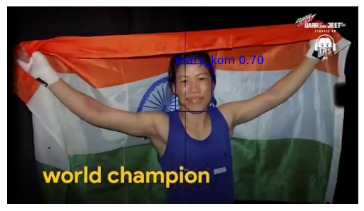

## 4.5 Flask API

### Getting Ready

We'll be developing the face recognition tools we need in the notebook before transferring them to a separate file for our app. Let's import what we'll need.


```python
%load_ext autoreload
%autoreload 2

from pathlib import Path

import matplotlib
import matplotlib.pyplot as plt
import torch
from facenet_pytorch import MTCNN, InceptionResnetV1
from PIL import Image
```

    The autoreload extension is already loaded. To reload it, use:
      %reload_ext autoreload


Since we'll be doing face detection and identification, we'll need both `MTCNN` and `InceptionResnet`. We'll use the settings from the previous lesson for `MTCNN`: `image_size=240`, `min_face_size=40`. Since we'll be identifying all faces in the image, use `keep_all=True`.

To be safe, we'll also set `InceptionResnet` to `eval` mode.

**Task 4.5.1:** Load `MTCNN` and `InceptionResnet`. Use the `vggface2` weights for `InceptionResnet`.


```python
mtcnn = MTCNN(image_size=240, min_face_size=40, keep_all=True)

resnet = InceptionResnetV1(pretrained='vggface2')

resnet = resnet.eval()

print(f"MTCNN image size: {mtcnn.image_size}")
print(f"MTCNN keeping all faces: {mtcnn.keep_all}")
print(f"InceptionResnet weight set: {resnet.pretrained}")
```

    MTCNN image size: 160
    MTCNN keeping all faces: True
    InceptionResnet weight set: vggface2


We'll also need the library of known faces we created in the previous lesson.

**Task 4.5.2:** Load the `embeddings.pt` file with `torch`.


```python
embedding_data = torch.load("embeddings.pt")

print(f"Known names: {[data[1] for data in embedding_data]}")
```

    Known names: ['mary_kom', 'ranveer']


We'll be getting images uploaded to our app, rather than reading from disk. But we'll need to test things as we go, so let's get a few sample images.

**Task 4.5.3:** Create a variable to access the extracted frames in `project4/data/extracted_frames`. Use `pathlib`.


```python
project_dir = Path("project4/data")
images_dir = project_dir / "extracted_frames"

print(images_dir)
```

    project4/data/extracted_frames


Here are two sample images to test as we go.


```python
sample_single = Image.open(images_dir / "frame_10.jpg")
sample_multiple = Image.open(images_dir / "frame_1280.jpg")
```


```python
sample_single
```


    

    


```python
sample_multiple
```


    

    


### Face Recognition

Our app will be taking in images, detecting the faces in them, and returning an output with the faces highlighted and labeled. This is the same thing we did in the previous notebook.

This consists of several steps:
- Detect if there any faces and get the bounding boxes and probabilities
- Get the cropped images for those faces
- Only work on the faces with high probability of being a face
- Get the embeddings for those faces
- Find the distances from those embeddings to the ones in our library
- Select the correct label (or "Undetected" if none match)
- Draw the bounding boxes and labels on the images

We'll be more _modular_ this time. This means we'll break the code into small pieces, each doing a specific task. We'll do our steps as separate functions, then put them together at the end.

### Locating Faces

Let's start with the first two steps. These involve running `mtcnn.detect` to get the bounding boxes, and `mtcnn` directly (with the `return_prob=True` argument) to get the cropped images and probabilities. We've reformatted the output a bit to make things easier later.

**Task 4.5.4:** Run `mtcnn` to get the cropped images and probabilities, and the bounding boxes in the function below.


```python
def locate_faces(image):

    cropped_images, probs = mtcnn(image, return_prob=True)

    boxes, _ = mtcnn.detect(image)

    if boxes is None or cropped_images is None:
        return []
    else:
        return list(zip(boxes, probs, cropped_images))
```

We'll do a test run on the `sample_multiple` with Mary with a picture of her boxing victory in the background. We're saving the list of detected faces that come out to `multiple_faces`, which we'll use for later tests as well. Note that there are actually five faces here - there's someone in the background behind the referee.


```python
multiple_faces = locate_faces(sample_multiple)
print(f"How many faces in the sample with 5 faces: {len(multiple_faces)}")
```

    How many faces in the sample with 5 faces: 5


So far so good!

<div class="alert alert-info" role="alert">
Our only argument in <tt>locate_faces</tt> is <tt>image</tt>, but the function also uses the <tt>mtcnn</tt> variable. Since that's present in the "global scope", outside of the function, the function looks for it and finds it. This presents a small danger - we have to remember to create that variable before we run our function. We could, instead, make that another argument. Besides being clearer, that would also let us switch out models if we wanted to! But it adds complexity to calling our code, so we're opting for the simpler method here.
</div>

Instead of returning three lists, we're now returning one list. Each element in the list corresponds to one face. Each of those faces has three pieces of information, in the order: bounding box, probabilities, cropped image. Let's look at the first one.


```python
face = multiple_faces[0]
print(f"First bounding box: {face[0]}")
print(f"First probability: {face[1]}")
print(f"Shape of first cropped image: {face[2].shape}")
```

    First bounding box: [382.6419677734375 65.2323989868164 467.39208984375 171.98997497558594]
    First probability: 0.999975323677063
    Shape of first cropped image: torch.Size([3, 160, 160])


Looks like it's definitely a face. Why did we reorganize this? Now we can build a function that only worries about one face, then loop over it.

### Determining Names

For the moment, we'll skip the step about filtering out low probability faces and come back to it. Then next steps after that are to get the embedding for our face, and compare it to the known faces. We'll want to get back both the name (if we know it) and the distance.

**Task 4.5.5:** Fill in the missing parts of this function.


```python
def determine_name_dist(cropped_image, threshold=0.9):
    emb = resnet(cropped_image.unsqueeze(0))

    distances = []
    for known_emb, name in embedding_data:
        dist = torch.dist(emb, known_emb)
        distances.append((dist, name))

    dist, closest = min(distances)

    if dist < threshold:
        name = closest
    else:
        name = "Undetected"

    return name, dist
```

And to see if it worked, let's run it on our faces. We expect two of these to be Mary, the rest are people we haven't seen before and should come back as `Undetected`.


```python
print("Who's in the picture with 5 faces, with distances?")
for index, face in enumerate(multiple_faces):
    print(f"{index}: {determine_name_dist(face[2])}")
```

    Who's in the picture with 5 faces, with distances?
    0: ('mary_kom', tensor(0.6333, grad_fn=<DistBackward0>))
    1: ('Undetected', tensor(1.2653, grad_fn=<DistBackward0>))
    2: ('Undetected', tensor(1.2421, grad_fn=<DistBackward0>))
    3: ('mary_kom', tensor(0.6671, grad_fn=<DistBackward0>))
    4: ('Undetected', tensor(1.1890, grad_fn=<DistBackward0>))


Great! That's what we expected. Now we need to alter the image to outline the faces and label names.

### Labeling Images

The function below adds the box and label to an _existing_ image. To use it, we'll need to plot our image with `matplotlib`, then call this function in the same cell. We'll be reusing the same structure from the previous lessons, with a little simplification.

**Task 4.5.6:** Fill in the missing portions of this plotting function.


```python
def label_face(name, dist, box, axis):
    """Adds a box and a label to the axis from matplotlib
    - name and dist are combined to make a label
    - box is the four corners of the bounding box for the face
    - axis is the return from fig.subplots()
    Call this in the same cell as the figure is created"""

    rect = plt.Rectangle((box[0], box[1]),
                         box[2] - box[0],
                         box[3] - box[1],
                         fill=False,
                         color="blue")
    axis.add_patch(rect)

    if name == "Undetected":
        color = "red"
    else:
        color = "blue"

    label = f"{name} {dist:.2f}"
    axis.text(box[0], box[1], label, fontsize="large", color=color)
```

To demonstrate how it works, we'll plot the first face found in the multiple faces. The code at the beginning sets `matplotlib` to create an output image the same size as the photo we're working with.


```python
width, height = sample_multiple.size
dpi = 96
fig = plt.figure(figsize=(width / dpi, height / dpi), dpi=dpi)
axis = fig.subplots()
axis.imshow(sample_multiple)
plt.axis("off")

face = multiple_faces[0]
cropped_image = face[2]
box = face[0]

name, dist = determine_name_dist(cropped_image)

label_face(name, dist, box, axis)
```


    

    


Now we can run this in a loop on each face.

**Task 4.5.7:** Fill in the needed loop to go over the faces in `multiple_faces`.


```python
width, height = sample_multiple.size
dpi = 96
fig = plt.figure(figsize=(width / dpi, height / dpi), dpi=dpi)
axis = fig.subplots()
axis.imshow(sample_multiple)
plt.axis("off")

for face in multiple_faces:
    box, prob, cropped_image = face

    name, dist = determine_name_dist(cropped_image)

    label_face(name, dist, box, axis)
```


    

    


Great! We've got a function we can call to add the boxes and labels to an image. This will make our later code easier to understand.

### Putting it together

We have all of our pieces. Let's put them all together into one function we can call on an image. This code will look more streamlined than previous lessons, since we'll be calling functions rather than writing out all the code. This is a big benefit of the modular approach, it makes it clearer what we're doing. The details are separated out into the functions.

**Task 4.5.8:** Fill in the missing pieces to put our functions together into a larger whole.


```python
def add_labels_to_image(image):
    # This sets the image size
    # and draws the original image
    width, height = image.width, image.height
    dpi = 96
    fig = plt.figure(figsize=(width / dpi, height / dpi), dpi=dpi)
    axis = fig.subplots()
    axis.imshow(image)
    plt.axis("off")

    # Use the function locate_faces to get the individual face info
    faces = locate_faces(image)

    for box, prob, cropped in faces:
        # If the probability is less than 0.90,
        # It's not a face, skip this run of the loop with continue
        if prob < 0.9:
            continue
        
        # Call determine_name_dist to get the name and distance
        name, dist = determine_name_dist(cropped)

        # Use label_face to draw the box and label on this face
        label_face(name, dist, box, axis)

    return fig
```

We can test this by running it on our `sample_multiple` (the original image). 


```python
labeled_multiple = add_labels_to_image(sample_multiple)
```


    

    


```python
type(labeled_multiple)
```


    matplotlib.figure.Figure


```python
labeled_multiple
```


    

    


<div class="alert alert-info" role="alert">
You may find it odd that we saved the result to a variable, but the image was still displayed. This is something that happens in Jupyter. If we were running this from other Python utilities, the image would only be displayed when we ask. If we hadn't saved the result to a variable, the image would actually have been displayed twice here! That's because one way to display it, in Jupyter, is to have the image variable as the last line in a cell. This is also why we need to be sure to run all of our code to alter the image in the same cell, as Jupyter will try to display the image at the end of the cell.
</div>

Let's also test this on our other image, it should correctly identify the interviewer.

**Task 4.5.9:** Call our `add_labels_to_image` function on `sample_single` and save the result to `labeled_single`.


```python
labeled_single = add_labels_to_image(sample_single)
```


    

    


We're in good shape! Now we can run our whole face recognition process with a single function call on our image. We're ready to start building our app.


```python
labeled_single
```


    

    


### Moving to a File

Our app won't be able to see what's in our notebook. We'll need to move our code to a `py` file. We won't need to alter it, it's ready to go as-is. The `face_recognition.py` has slots for all the things we'll need. Thankfully, we don't need everything. What we do need is:

- The imports
- Creating our `mtcnn` and `resnet`
- Reading the `embedding_data` from a file (our known faces)
- The `locate_faces` function
- The `determine_name_dist` function
- The `label_face` function
- The `add_labels_to_image` function

**Task 4.5.10:** Fill in the `face_recognition.py` file.

We'll test that it worked by importing it and running it. If this works, we're done with the face recognition!


```python
import face_recognition
```


```python
test_multiple = face_recognition.add_labels_to_image(sample_multiple)
```


    

    


Excellent! This is a great tool for us. But we'd like to share it with the world!

### Flask Application

Not everyone can run the Python functions we created. We'll make this something anyone can use by building a web application using Flask. Once it's running, we'll have a web site that is very user friendly and runs our code behind the scenes.

Our Flask application will have three files:
- The `face_recognition.py` we just created, that has our logic
- `app.py`, the main application that will handle interaction
- `upload.html`, a web page to display to users

The `upload.html` already exists for us, it's in the `templates` directory. It creates an interface web page with two buttons, one to select which image to run on, and one to upload the file to be processed.

Let's build up the `app.py` so our users can interact with our code without knowing Python.

<div class="alert alert-info" role="alert">
You can read more about how Flask works <a href="https://flask.palletsprojects.com/en/3.0.x/">here</a> if you want to try building your own app. There are also many good tutorials on the web, the one that is included in the Flask documentation is not meant for people completely new to it.
</div>

### Home Page

The first thing we'll do is make our interface page available. We'll worry about adding in our face recognition code in the next section.

In Flask, we create a function to tell it what to display. That's already done in `app.py`, it's the `home` function. It prepares the HTML from `upload.html` for us and returns that. Our user will see what the function returns. But we need to tell Flask what part of our website will run that code. We do that by setting a _route_.

We want to send someone that comes to our app directly to that page, so we'll direct the `"/"`  endpoint to go to our `home` function. We do this by adding

```python
@app.route("/")
```

on the line _before_ we define our function. This is called a decorator.

**Task 4.5.11:** Add the route decorator to the line before we define the `home` function in `app.py`. Make sure you save the file!

<div class="alert alert-info" role="alert">
You may wonder why the function is <tt>render_template</tt> if it just prepares HTML. It does more than that! Flask allows us to set up HTML files that can be altered before they're displayed, by putting "to be filled" slots in the file. You can read more about it <a href="https://flask.palletsprojects.com/en/3.0.x/tutorial/templates/">here</a> if you're interested.
</div>

We can now look at our app! The face recognition isn't connected yet, so that part won't work. But we can see what it looks like.

To run it, use the Launcher (the plus button next to the notebook tabs) and start a terminal. **Make sure you're in the directory with the `app.py` file** - you can check by running `ls`, you should see `app.py` in the list of things. If not, use `cd` to change to the right directory.

Now we can run our app by typing this in the terminal (you can cut and paste):

```bash
gunicorn --bind 0.0.0.0:9000 app:app
```

**Task 4.5.12:** Start the app running in your terminal!

<div class="alert alert-warning">
    <p><strong>Warning: difference with video</strong></p>
    <p>The Video "Start App" from Task 4.5.11 starts <code>gunicorn</code> and binds it to `localhost`. We have since changed it to bind it to <code>0.0.0.0:9000</code>. We have also removed the <code>--workers 4</code> parameter, as it only slows things down. Parallelism is not required for this simple app. Make sure you're using the updated version:</p>
    <p><code>gunicorn --bind 0.0.0.0:9000 app:app</code></p>
</div>

After a few moments, you should see messages in the terminal about booting workers. That means it's up and running.

Let's look at it and see what we've got. `gunicorn` has started a web server running, which we can access as regular web page!

To preview our page, we'll need to switch to the `Flask Website` view on the top tabs. Here's a quick summary of the steps to follow:


If you submit an image using the "Upload and analyze" button, you can get back to the main page by pressing back on your browser.

**Task 4.5.13:** Go to your app page and see what it looks like. Try to play with it! It works best with `jpg` images.

<div class="alert alert-warning">
    <p><strong>Warning: difference with video</strong></p>
    <p>The Video "Test App" from Task 4.5.13 opens the website after following different URLs (like <code>vm.something.edu</code>. We have since changed it and you can access your website from the tab "Flask Website" in the top bar of your lab.</p>
</div>

When you're done, shut off `gunicorn`. You can do this by going back to the terminal and pressing `ctrl-c` (the `ctrl` button and the `c` button at the same time). You have to be in the terminal for this to work, and you should see your prompt come back after a message about shutting down.

### Connecting the Face Recognition

The app shows our homepage, but the "Upload and analyze" button doesn't do what we want. We need to hook it up to our face recognition code.

You can open the `upload.html` file to see what's in it by right clicking on it in the browser, and selecting "Open With" then "Editor". It's an HTML file describing a web site with a form. The part we care about is the first line of the form:

```html
<form action="recognize" method="post" enctype="multipart/form-data">
```

This says it's going to send a POST request to the `recognize` endpoint. Another function in `app.py`, named `process_image`, already has the decorator for this. Anything going to `recognize` will get routed to that function. In this case, the function will get a request containing our image.

Let's hook this function up to the code in our `face_recognition.py` file. First order of business is to import it. There's a comment near the top of the file where we should import it.

**Task 4.5.14:** In the `app.py` file, import the `add_labels_to_image` from `face_recognition`. You don't need to include the `.py`, Python knows to look for that.

We'll run some code in the notebook to check that things are working as expected. The behavior of our app hasn't changed yet, but this code will check that our changes are coming along correctly. If you don't get an error, things are working as expected.


```python
import app
```


```python
assert hasattr(app, "add_labels_to_image"), "import not successful"
```

Continuing our practice of modular code, the `process_image` function handles input and output. It will read in the image, extract the image data (as `image_data`), then pass it to a function called `run_face_recognition`. This is where we hook in our code. `process_image` then takes the output `matplotlib` image and turns it into something web friendly.

`run_face_recognition` will get `image_data`, the raw binary of the image file. Our function is expecting a `PIL` image, which isn't what we get in `image_data`. Thankfully, we can call `Image.open` directly on the `image_data`, as if it were a filename. Then we need to call our `add_labels_to_image` function on that. There are already lines marked for this in the `run_face_recognition` function, we need to fill them in.

**Task 4.5.15:** Fill in the code to open the image with `PIL` and run our `add_labels_to_image` function, in the `run_face_recognition` function in `app.py`.


```python
# Tests if the image processing worked
# you'll get an error if it didn't
f = open("project4/data/images/mary_kom/frame_115.jpg", "rb")
res = app.run_face_recognition(f)
f.close()

assert isinstance(res, matplotlib.figure.Figure), "Image did not process"
```


    

    


And we should be all set now! Let's see it in action.

**Task 4.5.16:** Start `gunicorn`, the same way we did before, and open the page for our app again.


```python
# Go to the terminal, start gunicorn and check activity on the left panel
```

If everything has gone according to plan, it should be running. It looks the same, but it will actually work when you upload an image.

You can get some images from the video we've been working with by looking in the `project4/data/extracted_frames` directory. You'll have to download them to your computer to be able to upload them, the app doesn't have access to them. You can do that by using the browser to go to the directory, then right clicking on the image and selecting "Download". 

Here are a good few to try (you don't have to try all of them):

- `frame_5.jpg`
- `frame_100.jpg`
- `frame_210.jpg`
- `frame_140.jpg`
- `frame_300.jpg`
- `frame_320.jpg`

Remember you can get back to the main page by pressing back on your browser after you submit an image.

**Task 4.5.17:** Try uploading some images to the app. You can use the ones suggested above, or any `jpg` image you want.

<div class="alert alert-info" role="alert">
Right now, this app has trouble with many image file formats. Our network is expecting an image with three color channels, in the RGB format. Not everything is like that! But <tt>PIL</tt> knows how to convert images. You can remedy the problem by altering our `run_face_recognition` function. After opening the file as a <tt>PIL</tt> image, tell it to <tt>convert('RGB')</tt> before giving it to our face recognition code. We really should do this <i>in</i> our face recognition process, but we chose not to add that complexity in this lesson.
</div>

---
&#169; 2024 by [WorldQuant University](https://www.wqu.edu/)
