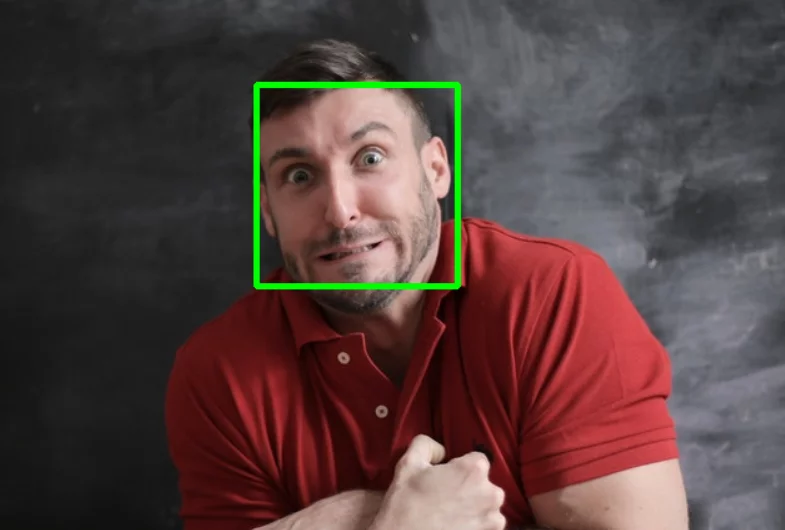

# Flask API 
## Making a Web App to Simulate Face Recognition & Face Detection

<p float="center">
    
</p

---

# Import Needed Libraries

```python
from pathlib import Path

import matplotlib
import matplotlib.pyplot as plt
import torch
from facenet_pytorch import MTCNN, InceptionResnetV1
from PIL import Image
```

---

# Load Models and Embeddings

```python
mtcnn = MTCNN(image_size=240, min_face_size=40, keep_all=True)

resnet = InceptionResnetV1(pretrained='vggface2')
embedding_data = torch.load("embeddings.pt")

resnet = resnet.eval()
```

---

# Load Dataset Images

```python
project_dir = Path("project4/data")
images_dir = project_dir / "extracted_frames"

sample_single = Image.open(images_dir / "frame_10.jpg")
sample_multiple = Image.open(images_dir / "frame_1280.jpg")
```

---

# Face Detection Function

```python
def locate_faces(image):

    cropped_images, probs = mtcnn(image, return_prob=True)

    boxes, _ = mtcnn.detect(image)

    if boxes is None or cropped_images is None:
        return []
    else:
        return list(zip(boxes, probs, cropped_images))
```

---

# Face Identification Function

```python
def determine_name_dist(cropped_image, threshold=0.9):

    emb = resnet(cropped_image.unsqueeze(0))

    distances = []
    for known_emb, name in embedding_data:
        dist = torch.dist(emb, known_emb)
        distances.append((dist, name))

    dist, closest = min(distances)

    if dist < threshold:
        name = closest
    else:
        name = "Undetected"

    return name, dist
```

---

# Label Drawing Function

```python
def label_face(name, dist, box, axis):

    rect = plt.Rectangle(
        (box[0], box[1]),
        box[2] - box[0],
        box[3] - box[1],
        fill=False,
        color="blue"
    )
    axis.add_patch(rect)

    if name == "Undetected":
        color = "red"
    else:
        color = "blue"

    label = f"{name} {dist:.2f}"
    axis.text(box[0], box[1], label, fontsize="large", color=color)
```

---

# Full Image Processing Pipeline

```python
def add_labels_to_image(image):

    width, height = image.width, image.height
    dpi = 96

    fig = plt.figure(figsize=(width / dpi, height / dpi), dpi=dpi)
    axis = fig.subplots()
    axis.imshow(image)
    plt.axis("off")

    faces = locate_faces(image)

    for box, prob, cropped in faces:

        if prob < 0.9:
            continue

        name, dist = determine_name_dist(cropped)
        label_face(name, dist, box, axis)

    return fig
```

---

# Sample Outputs (Notebook Results)

```python
multiple_faces = locate_faces(sample_multiple)
```

```python
width, height = sample_multiple.size
dpi = 96
fig = plt.figure(figsize=(width / dpi, height / dpi), dpi=dpi)
axis = fig.subplots()
axis.imshow(sample_multiple)
plt.axis("off")

for face in multiple_faces:
    box, prob, cropped_image = face

    name, dist = determine_name_dist(cropped_image)

    label_face(name, dist, box, axis)
```

```python
labeled_multiple = add_labels_to_image(sample_multiple)
labeled_single = add_labels_to_image(sample_single)
```

---

# Face Recognition Module (face_recognition.py)

```python
import matplotlib.pyplot as plt
import torch
from facenet_pytorch import MTCNN, InceptionResnetV1
from PIL import Image

mtcnn = MTCNN(image_size=240, min_face_size=40, keep_all=True)
resnet = InceptionResnetV1(pretrained='vggface2')
embedding_data = torch.load("embeddings.pt")
resnet = resnet.eval()


def locate_faces(image):
    cropped_images, probs = mtcnn(image, return_prob=True)
    boxes, _ = mtcnn.detect(image)

    if boxes is None or cropped_images is None:
        return []
    return list(zip(boxes, probs, cropped_images))


def determine_name_dist(cropped_image, threshold=0.9):
    emb = resnet(cropped_image.unsqueeze(0))

    distances = []
    for known_emb, name in embedding_data:
        dist = torch.dist(emb, known_emb)
        distances.append((dist, name))

    dist, closest = min(distances)

    if dist < threshold:
        name = closest
    else:
        name = "Undetected"

    return name, dist


def label_face(name, dist, box, axis):

    rect = plt.Rectangle(
        (box[0], box[1]),
        box[2] - box[0],
        box[3] - box[1],
        fill=False,
        color="blue"
    )
    axis.add_patch(rect)

    color = "red" if name == "Undetected" else "blue"
    label = f"{name} {dist:.2f}"
    axis.text(box[0], box[1], label, fontsize="large", color=color)


def add_labels_to_image(image):

    width, height = image.width, image.height
    dpi = 96

    fig = plt.figure(figsize=(width / dpi, height / dpi), dpi=dpi)
    axis = fig.subplots()
    axis.imshow(image)
    plt.axis("off")

    faces = locate_faces(image)

    for box, prob, cropped in faces:

        if prob < 0.9:
            continue

        name, dist = determine_name_dist(cropped)
        label_face(name, dist, box, axis)

    return fig
```

---

# Flask Application (app.py)

```python
import io

from flask import Flask, render_template, request, send_file
from PIL import Image

from face_recognition import add_labels_to_image

app = Flask(__name__)


@app.route("/")
def home():
    return render_template("upload.html")


@app.route("/recognize", methods=["POST"])
def process_image():

    if "image" not in request.files:
        return "No image provided", 400

    file = request.files["image"]

    if not file.mimetype.startswith("image/"):
        return "Image format not recognized", 400

    image_data = file.stream

    img_out = run_face_recognition(image_data)

    if img_out == Ellipsis:
        return "Image processing not enabled", 200
    else:
        out_stream = matplotlib_to_bytes(img_out)
        return send_file(out_stream, mimetype="image/jpeg")


def run_face_recognition(image_data):

    input_image = Image.open(image_data)

    img_out = add_labels_to_image(input_image)

    return img_out


def matplotlib_to_bytes(figure):

    buffer = io.BytesIO()
    figure.savefig(buffer, format="jpg", bbox_inches="tight")
    buffer.seek(0)
    return buffer


if __name__ == "__main__":
    app.run(debug=True)
```

---

# Running the App

```bash
gunicorn --bind 0.0.0.0:9000 app:app
```

---

# Notes

- Images must be uploaded as `.jpg`
- Faces are detected using MTCNN
- Recognition uses FaceNet embeddings
- Output is a labeled image returned to browser

---

# Dataset Images Used

- frame_5.jpg  
- frame_10.jpg  
- frame_100.jpg  
- frame_140.jpg  
- frame_210.jpg  
- frame_300.jpg  
- frame_320.jpg  
- frame_1280.jpg  

---

# System Flow

User uploads image → Flask API → Face detection (MTCNN) → Embedding (FaceNet) → Matching → Label drawing → Image returned

---

# Usage Guidelines

This file is licensed under Creative Commons Attribution-NonCommercial-NoDerivatives 4.0 International.

You can:
- ✓ Download this file  
- ✓ Post this file in public repositories  

You must always:
- ✓ Give credit to WorldQuant University for the creation of this file  
- ✓ Provide a link to the license  

You cannot:
- ✗ Create derivatives or adaptations of this file  
- ✗ Use this file for commercial purposes  

Failure to follow these guidelines is a violation of your terms of service and could lead to your expulsion from WorldQuant University and the revocation your certificate.

---

# © 2024 WorldQuant University  
Licensed under CC BY-NC-ND 4.0
```
